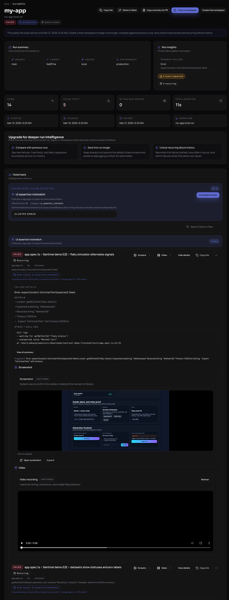
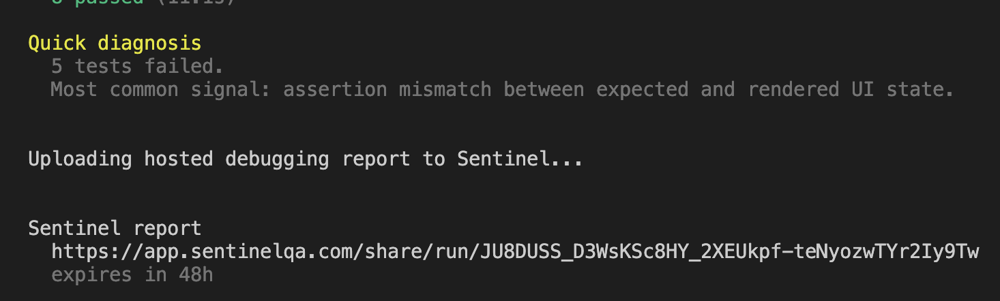

# Playwright Reporter

After every failed run, reporter prints a shareable debugging link:

Sample run: https://app.sentinelqa.com/share/1f343d91-be17-4c14-b1b9-2d4e8ef448d2

Open it to inspect failures instantly or share it in Slack, PRs, or GitHub issues.

[](https://www.npmjs.com/package/@sentinelqa/playwright-reporter)
[](https://www.npmjs.com/package/@sentinelqa/playwright-reporter)
[](./LICENSE)

From failed CI run → root cause in seconds.
Get a shareable Playwright debugging link with traces, screenshots, and failure context — no setup required.

Works with no account or API key required.

Use it to get a shareable hosted run link from CI or local development, then upgrade to Sentinel Cloud for richer history and intelligence.




## Features

- Free hosted debugging links by default, with no account or API key required
- Public run page that opens on unified failures across the run
- Within-run failure grouping so repeated failures collapse into one issue
- Public failure pages with screenshots, evidence, parsed errors and light summaries
- Copyable share actions for Slack, PRs, and debugging handoff
- Deterministic quick diagnosis in the terminal after failed runs
- Playwright traces, screenshots, videos and logs uploaded automatically
- 48-hour public share links on the free hosted flow
- Works with existing Playwright reporter setup
- Optional live failure capture for richer Sentinel Cloud analysis
- CI run history, retention, and deeper AI debugging in Sentinel Cloud

## Why this exists

Debugging Playwright failures usually means downloading traces, screenshots, and logs separately from CI.

Reporter uploads those artifacts into a single hosted Sentinel run page so you can open one link, inspect failures fast, and share that link with the rest of the team.

## CLI diagnosis

Sentinel is not just a report link.

On failed runs, it prints a compact terminal diagnosis that answers:

1. what broke
2. why it broke
3. where to look
4. what changed
5. what to do next

The goal is simple:

you should not need to open logs first.

Typical CLI output:

```text
Sentinel diagnosis
━━━━━━━━━━━━━━━━━━━━━━━━━━━━━━━━━━

NEW FAILURE after 8 passing runs

What broke: 10 tests failed
Why: collapsed into 2 real issues

Issue 1: UI assertion mismatch (6 tests)
  Why: getByTestId('metric-pass-rate') showed "82%" instead of "88%"
  Where: app.spec.ts:43, app.spec.ts:69
  Expected: 88%
  Received: 82%
  What changed: "update analytics cards"
  Next: verify getByTestId('metric-pass-rate')
  Impact: 6 tests failing with same root cause
  Clears: fixing this likely clears 6 of 10 failures
```

On passed runs, Sentinel stays short and only prints a warning if there is a strong risk signal worth caring about.

## Why teams use the free version

- Drop one wrapper into `playwright.config.ts` and keep running `npx playwright test`
- Get a hosted Sentinel debugging link automatically on failed runs
- Share one public URL in Slack, PRs, or GitHub issues instead of passing around raw CI artifacts
- See unified failures, grouped failure patterns, screenshots, and evidence in one place
- Let teammates inspect the failure without needing your CI system or local machine

## Requirements

- Node.js 18+
- `@playwright/test` 1.40+

## Quick Start

`withSentinel()` is the default setup for everyone:

- best for free and local users
- zero-friction setup
- hosted Sentinel report link is generated automatically
- no `SENTINEL_TOKEN` required
- AI summaries use trace and reporter evidence, but are less precise than live page capture

Install:

```bash
npm install -D @sentinelqa/playwright-reporter
```

Add Sentinel to your Playwright config:

```ts
import { defineConfig } from "@playwright/test";
import { withSentinel } from "@sentinelqa/playwright-reporter";

export default withSentinel(
  defineConfig({
    reporter: [["line"]],
    outputDir: "test-results",
    use: {
      trace: "retain-on-failure",
      screenshot: "only-on-failure",
      video: "retain-on-failure",
    },
  }),
  {
    project: "my-app",
  },
);
```

## Example

Run your Playwright tests:

```bash
npx playwright test
```

If tests fail, Sentinel uploads a hosted debugging report and prints the shareable link in the terminal.

Open the hosted report to inspect:

- failed tests across jobs
- within-run grouped failures
- screenshots and videos
- trace links
- parsed failure details
- light summaries
- shareable public debugging page

The free hosted public flow is designed for distribution:

- one shareable debugging link per run
- public read-only pages
- fast enough to use in CI comments and Slack threads
- clear upgrade path into a full Sentinel workspace when teams want history, retention, and deeper analysis

## Modes

### Free hosted mode

If `SENTINEL_TOKEN` is not set, the reporter uploads the run to a hosted public Sentinel report and prints the shareable URL.

This free public flow includes:

- hosted run page
- hosted failure pages
- grouped failures inside the run
- light summaries
- copy/share actions
- 48-hour share links

### Workspace mode

If `SENTINEL_TOKEN` is set, the reporter uploads into your Sentinel workspace instead of the free hosted public flow.

```bash
SENTINEL_TOKEN=your_project_ingest_token npx playwright test
```

For local runs outside CI, Sentinel will use your local git metadata automatically when available.

## What `withSentinel()` does

- Preserves your existing reporter configuration
- Injects a Playwright JSON reporter if one is missing
- Sets sensible artifact defaults:
  - trace: `retain-on-failure`
  - screenshot: `only-on-failure`
  - video: `retain-on-failure`
- Uploads the run to hosted Sentinel at the end of the test run

## Recommended Cloud Setup

If you use Sentinel Cloud and want the best AI summaries and fix suggestions, keep `withSentinel()` in your Playwright config and add the live capture fixture.

Why:

- `withSentinel()` alone works from reporter and trace data
- a Playwright reporter does not get the live `page` fixture
- the live capture fixture lets Sentinel collect richer DOM and code context at the exact failure moment
- this is required for the highest-quality DOM-aware patches

Create one shared test wrapper:

```ts
// tests/test.ts
import { test as base, expect } from "@playwright/test";
import { attachSentinelFailureCapture } from "@sentinelqa/playwright-reporter/fixtures";

export const test = attachSentinelFailureCapture(base);
export { expect };
```

Then import from that file in your specs instead of `@playwright/test`:

```ts
import { test, expect } from "./test";
```

Use this cloud setup when you want:

- best AI summaries
- best fix suggestions
- richer DOM-aware diagnosis
- more reliable code patches grounded in real page state

Free and local-only users do not need this. The standard `withSentinel()` setup remains the simplest path and will upload a hosted Sentinel report automatically.

## Options

```ts
withSentinel(config, {
  project: "my-app",
  playwrightJsonPath: "playwright-report/report.json",
  playwrightReportDir: "playwright-report",
  testResultsDir: "test-results",
  artifactDirs: ["tmp/extra-artifacts"],
  verbose: true,
});
```

## Sentinel Cloud (optional)

Sentinel Cloud adds:

- hosted debugging dashboards
- CI run history
- AI-generated failure summaries
- flaky test detection
- shareable run links
- longer retention
- compare against previous runs
- recurring failure history
- richer fix suggestions and team workflows

Free for up to 100 CI runs per month.
Create an account at [sentinelqa.com](https://sentinelqa.com).
