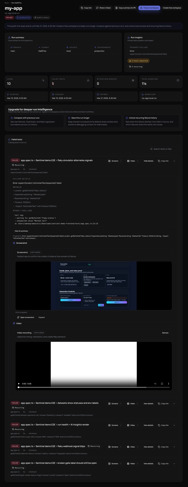
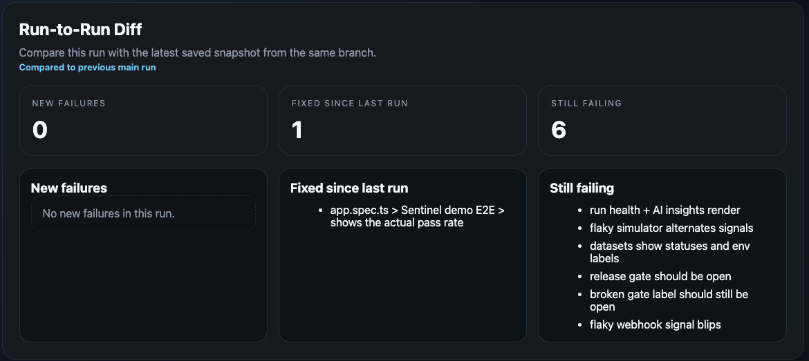

# Playwright Reporter

[](https://www.npmjs.com/package/@sentinelqa/playwright-reporter)
[](https://www.npmjs.com/package/@sentinelqa/playwright-reporter)
[](./LICENSE)

A Playwright reporter that aggregates traces, screenshots, videos, and logs
into a single debugging report for failed tests.

Works locally out of the box with no account required.

Optionally upload runs to Sentinel Cloud for CI history and AI failure analysis.





## Features

- Aggregates Playwright traces, screenshots, videos, and logs
- Generates a local HTML debugging report
- Prints a deterministic quick diagnosis in the terminal after failed runs
- Adds a failure digest to the local HTML report
- Groups similar failures so repeated symptoms are easy to spot
- Lets you copy debug summaries for Slack, Jira, and GitHub issues
- Compares the current run to the previous run on the same branch
- Works with existing Playwright reporter setup
- Optional Sentinel Cloud integration
- CI run history and AI debugging summaries in cloud mode

## Why this exists

Debugging Playwright CI failures often means downloading traces,
screenshots, and videos separately.

Reporter aggregates everything into one debugging report
so you can quickly understand what failed.

## Requirements

- Node.js 18+
- `@playwright/test` 1.40+

## Quick Start

`withSentinel()` is the default setup for everyone:

- best for free and local users
- zero-friction setup
- local HTML report works exactly as today
- cloud upload works when configured
- AI summaries use trace and reporter evidence, but are less precise than live page capture

Install:

```bash
npm install -D @sentinelqa/playwright-reporter
```

Add Sentinel to your Playwright config:

```ts
import { defineConfig } from "@playwright/test";
import { withSentinel } from "@sentinelqa/playwright-reporter";

export default withSentinel(
  defineConfig({
    reporter: [["line"]],
    outputDir: "test-results",
    use: {
      trace: "retain-on-failure",
      screenshot: "only-on-failure",
      video: "retain-on-failure",
    },
  }),
  {
    project: "my-app",
  },
);
```

## Example

Run your Playwright tests:

```bash
npx playwright test
```

If tests fail and `SENTINEL_TOKEN` is not set, Sentinel generates:

- `sentinel-report/index.html`
- `sentinel-debug.html`

Open the report to inspect:

- failure digest
- similar failure groups
- run-to-run diff
- failed tests
- screenshots
- videos
- trace files
- logs

## Modes

### Local mode

If `SENTINEL_TOKEN` is not set, the reporter generates a local HTML debugging report.

### Cloud mode

If `SENTINEL_TOKEN` is set in CI, the reporter uploads the run to Sentinel instead of generating the local HTML report.

```bash
SENTINEL_TOKEN=your_project_ingest_token npx playwright test
```

For intentional uploads outside CI, also set `SENTINEL_UPLOAD_LOCAL=1` and provide the usual commit and run metadata expected by the uploader.

Example:

```bash
SENTINEL_TOKEN=your_project_ingest_token \
SENTINEL_UPLOAD_LOCAL=1 \
GITHUB_SHA=abc123 \
GITHUB_REF_NAME=main \
GITHUB_RUN_ID=local-dev \
npx playwright test
```

## What `withSentinel()` does

- Preserves your existing reporter configuration
- Injects a Playwright JSON reporter if one is missing
- Reuses your existing Playwright HTML reporter path when configured
- Sets sensible artifact defaults:
  - trace: `retain-on-failure`
  - screenshot: `only-on-failure`
  - video: `retain-on-failure`

## Recommended Cloud Setup

If you use Sentinel Cloud and want the best AI summaries and fix suggestions, keep `withSentinel()` in your Playwright config and add the live capture fixture.

Why:

- `withSentinel()` alone works from reporter and trace data
- a Playwright reporter does not get the live `page` fixture
- the live capture fixture lets Sentinel collect richer DOM and code context at the exact failure moment
- this is required for the highest-quality DOM-aware patches

Create one shared test wrapper:

```ts
// tests/test.ts
import { test as base, expect } from "@playwright/test";
import { attachSentinelFailureCapture } from "@sentinelqa/playwright-reporter/fixtures";

export const test = attachSentinelFailureCapture(base);
export { expect };
```

Then import from that file in your specs instead of `@playwright/test`:

```ts
import { test, expect } from "./test";
```

Use this cloud setup when you want:

- best AI summaries
- best fix suggestions
- richer DOM-aware diagnosis
- more reliable code patches grounded in real page state

Free and local-only users do not need this. The standard `withSentinel()` setup remains the simplest path and continues to generate the local report the same way as before.

## Options

```ts
withSentinel(config, {
  project: "my-app",
  playwrightJsonPath: "playwright-report/report.json",
  playwrightReportDir: "playwright-report",
  testResultsDir: "test-results",
  artifactDirs: ["tmp/extra-artifacts"],
  verbose: true,
  localReportDir: "sentinel-report",
  localReportFileName: "index.html",
  localRedirectFileName: "sentinel-debug.html",
});
```

## Sentinel Cloud (optional)

Sentinel Cloud adds:

- hosted debugging dashboards
- CI run history
- AI-generated failure summaries
- flaky test detection
- shareable run links

Free for up to 100 CI runs per month.
Create an account at [sentinelqa.com](https://sentinelqa.com).
